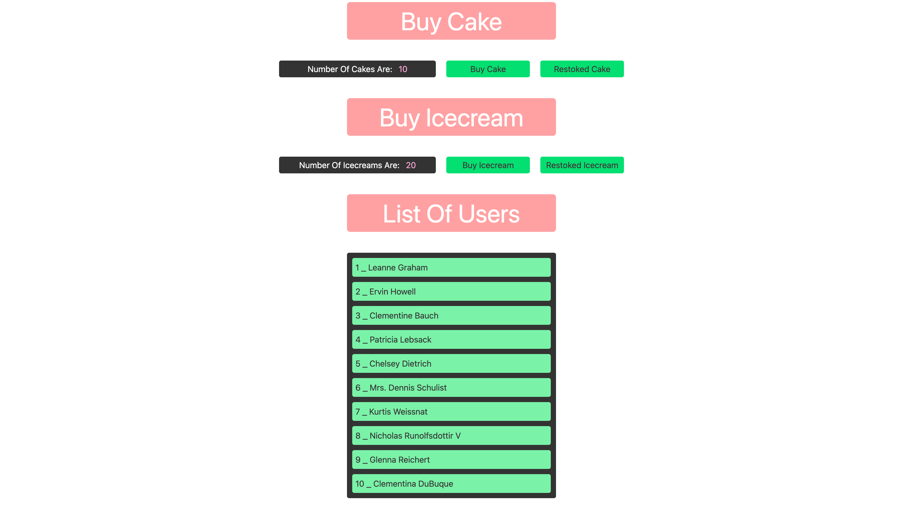

# ⚛️ Redux Toolkit + TypeScript Mastery

> **Part 3** (The Finale) of the Redux Mastery Series.

[](https://app.netlify.com/sites/redux-toolkit-ts-demo/deploys)
&nbsp;
[](https://redux-toolkit-ts-demo.netlify.app/)

This repository represents the **modern industry standard** for state management. It utilizes **Redux Toolkit (RTK)** within a **React** application, fully typed with **TypeScript**, and styled using **Tailwind CSS**.

---

## 📸 Project Preview


_(A fully responsive dashboard managing Cakes, Ice Creams, and Async Users)_

---

## 🔗 Live Demo

Click here to try the application:  
👉 **[https://redux-toolkit-ts-demo.netlify.app/](https://redux-toolkit-ts-demo.netlify.app/)**

---

## 🛠️ Tech Stack & Features

- **⚡ Vite:** Blazing fast build tool (Port: 3010).
- **📘 TypeScript:** Full static typing for State, Actions, and Thunks.
- **🧰 Redux Toolkit (RTK 2.x):**
  - `configureStore`: Simplified store setup with auto-middleware.
  - `createSlice`: Auto-generated actions & reducers (Immer powered).
  - `createAsyncThunk`: Handling async logic with strict generic types.
- **🎨 Tailwind CSS:** Utility-first responsive styling.
- **🐛 Redux Logger:** Middleware for tracking state changes in development.

---

## 📂 Project Structure (Feature-Based)

We follow the modern **Feature-based** pattern recommended by the Redux team:

```text
src/
├── app/
│   ├── store.ts      # Store configuration + Logger + Type Inference
│   └── hooks.ts      # Typed hooks (useAppDispatch, useAppSelector)
│
├── features/
│   ├── cake/         # Cake Slice & View Component
│   ├── icecream/     # Ice Cream Slice & View Component
│   └── user/         # Async User Slice (API handling) & View Component
│
├── App.tsx           # Main Application Layout
└── main.tsx          # Provider Setup & Entry Point
```

---

## 🧠 Key TypeScript Concepts Applied

### 1. Typed Hooks (`hooks.ts`)

Instead of using plain `useDispatch` and `useSelector`, we use custom hooks to infer types automatically throughout the app:

```typescript
export const useAppDispatch = () => useDispatch<AppDispatch>();
export const useAppSelector: TypedUseSelectorHook<RootState> = useSelector;
```

### 2. Async Thunk Typing

Handling API responses and custom error payloads using Generics to ensure type safety:

```typescript
// <ReturnType, ArgumentType, ThunkConfig>
export const fetchUsers = createAsyncThunk<UserDataProps[]>(...)
```

### 3. Error Handling

Using `rejectWithValue` to pass custom error messages (strings) to the reducer instead of the default serialized error object.

---

## 🚀 How to Run Locally

1.  **Clone the repository.**
2.  **Install dependencies:**
    ```bash
    npm install
    ```
3.  **Start the development server:**
    ```bash
    npm run dev
    ```
    _(The app will launch on `http://localhost:3010`)_

---

## 📝 License

This project concludes the Redux learning path, transitioning from Vanilla JS concepts to **Modern Production-Grade RTK with TypeScript**.
